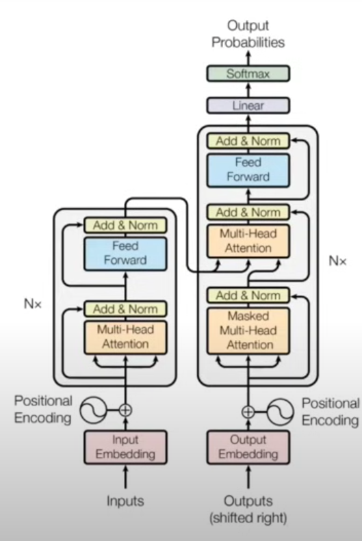

# Transformer Model Implementation

## Overview
This repository contains an implementation of the Transformer model from scratch using PyTorch. The model follows the architecture described in the original "Attention is All You Need" paper and is designed for machine translation, specifically translating from English to Italian.



### Disclaimer
This model has been trained for only 1 epoch. If you have sufficient computational power, it is recommended to train it for at least 20 epochs for better results.

### Reference
This implementation is based on the video tutorial by [Umar Jamil](https://www.youtube.com/watch?v=ISNdQcPhsts) ([Part 2](https://youtu.be/bCz4OMemCcA?si=hTBIo1JL9lYzrRE2)). You can find his GitHub repository under the username "hkproj."

Additional resource to refer : [Blog](https://jalammar.github.io/illustrated-transformer/) and Krish Naik's NLP course

---

## Model Components

### Input Embeddings
**Code:**
```python
class InputEmbeddings(nn.Module):
    def __init__(self, d_model: int, vocab_size: int) -> None:
        super().__init__()
        self.d_model = d_model
        self.vocab_size = vocab_size
        self.embedding = nn.Embedding(vocab_size, d_model)

    def forward(self, x):
        return self.embedding(x) * math.sqrt(self.d_model)
```

**Explanation:**
Input embeddings convert discrete token indices into dense vectors that represent the words in a continuous vector space. These embeddings are scaled by \(\sqrt{d_{model}}\) to maintain proper variance levels and ensure stable learning.

**Why is it used?**
Since neural networks cannot process categorical data directly, input embeddings allow the model to represent words in a meaningful way, capturing syntactic and semantic properties.

---

### Positional Encoding
**Code:**
```python
class PositionalEncoding(nn.Module):
    def __init__(self, d_model: int, seq_len: int, dropout: float) -> None:
        super().__init__()
        self.dropout = nn.Dropout(dropout)
        pe = torch.zeros(seq_len, d_model)
        position = torch.arange(0, seq_len, dtype=torch.float).unsqueeze(1)
        div_term = torch.exp(torch.arange(0, d_model, 2).float() * (-math.log(10000.0) / d_model))
        pe[:, 0::2] = torch.sin(position * div_term)
        pe[:, 1::2] = torch.cos(position * div_term)
        pe = pe.unsqueeze(0)
        self.register_buffer('pe', pe)

    def forward(self, x):
        x = x + self.pe[:, :x.shape[1], :].requires_grad_(False)
        return self.dropout(x)
```

**Explanation:**
Since transformers do not have an inherent sense of order like RNNs, positional encoding adds information about word positions in a sentence. The encoding is calculated using sinusoidal functions:
\[
PE_{pos,2i} = \sin(\frac{pos}{10000^{2i/d_{model}}})
\]
\[
PE_{pos,2i+1} = \cos(\frac{pos}{10000^{2i/d_{model}}})
\]

**Why is it used?**
It ensures that the transformer model understands the sequential relationships between words, which is crucial for tasks like translation.

---

### Multi-Head Attention
**Code:**
```python
class MultiHeadAttentionBlock(nn.Module):
    def __init__(self, d_model: int, h: int, dropout: float) -> None:
        super().__init__()
        self.d_model = d_model
        self.h = h
        assert d_model % h == 0, "d_model must be divisible by h"
        self.d_k = d_model // h
        self.w_q = nn.Linear(d_model, d_model, bias=False)
        self.w_k = nn.Linear(d_model, d_model, bias=False)
        self.w_v = nn.Linear(d_model, d_model, bias=False)
        self.w_o = nn.Linear(d_model, d_model, bias=False)
        self.dropout = nn.Dropout(dropout)

    @staticmethod
    def attention(query, key, value, mask, dropout: nn.Dropout):
        d_k = query.shape[-1]
        scores = (query @ key.transpose(-2, -1)) / math.sqrt(d_k)
        if mask is not None:
            scores.masked_fill_(mask == 0, -1e9)
        scores = scores.softmax(dim=-1)
        if dropout is not None:
            scores = dropout(scores)
        return scores @ value, scores

    def forward(self, q, k, v, mask):
        query = self.w_q(q).view(q.shape[0], q.shape[1], self.h, self.d_k).transpose(1, 2)
        key = self.w_k(k).view(k.shape[0], k.shape[1], self.h, self.d_k).transpose(1, 2)
        value = self.w_v(v).view(v.shape[0], v.shape[1], self.h, self.d_k).transpose(1, 2)
        x, _ = MultiHeadAttentionBlock.attention(query, key, value, mask, self.dropout)
        x = x.transpose(1, 2).contiguous().view(x.shape[0], -1, self.h * self.d_k)
        return self.w_o(x)
```

**Explanation:**
Multi-head attention allows the model to attend to different parts of the sequence simultaneously. The attention mechanism follows the formula:
\[
Attention(Q, K, V) = softmax(\frac{QK^T}{\sqrt{d_k}})V
\]

**Why is it used?**
Instead of attending to all words equally, attention mechanisms let the model focus on relevant words while processing a given word. Multi-head attention enhances this by using multiple attention mechanisms in parallel.

---

### Feed Forward Network
**Code:**
```python
class FeedForwardBlock(nn.Module):
    def __init__(self, d_model: int, d_ff: int, dropout: float) -> None:
        super().__init__()
        self.linear_1 = nn.Linear(d_model, d_ff)
        self.dropout = nn.Dropout(dropout)
        self.linear_2 = nn.Linear(d_ff, d_model)

    def forward(self, x):
        return self.linear_2(self.dropout(torch.relu(self.linear_1(x))))
```

**Explanation:**
The feed-forward network consists of two linear layers with a ReLU activation in between. It transforms the features extracted by the attention mechanism and allows for non-linearity.

---

### Encoder & Decoder
**Explanation:**
The **encoder** processes the input sequence, extracting features and encoding contextual information. The **decoder** uses the encoded information and previous outputs to generate the target sequence step by step.

---

### Building the Transformer
**Code:**
```python
def build_transformer(src_vocab_size: int, tgt_vocab_size: int, src_seq_len: int, tgt_seq_len: int, d_model: int=512, N: int=6, h: int=8, dropout: float=0.1, d_ff: int=2048) -> Transformer:
    src_embed = InputEmbeddings(d_model, src_vocab_size)
    tgt_embed = InputEmbeddings(d_model, tgt_vocab_size)
    src_pos = PositionalEncoding(d_model, src_seq_len, dropout)
    tgt_pos = PositionalEncoding(d_model, tgt_seq_len, dropout)
    encoder_blocks = [EncoderBlock(d_model, MultiHeadAttentionBlock(d_model, h, dropout), FeedForwardBlock(d_model, d_ff, dropout), dropout) for _ in range(N)]
    decoder_blocks = [DecoderBlock(d_model, MultiHeadAttentionBlock(d_model, h, dropout), MultiHeadAttentionBlock(d_model, h, dropout), FeedForwardBlock(d_model, d_ff, dropout), dropout) for _ in range(N)]
    encoder = Encoder(d_model, nn.ModuleList(encoder_blocks))
    decoder = Decoder(d_model, nn.ModuleList(decoder_blocks))
    return Transformer(encoder, decoder, src_embed, tgt_embed, src_pos, tgt_pos, ProjectionLayer(d_model, tgt_vocab_size))
```

This function initializes all transformer components, including input embeddings, positional encodings, multi-head attention, and feed-forward networks, then assembles them into an encoder-decoder structure.

---

## Conclusion
This implementation showcases the core components of a transformer for English-to-Italian translation.


